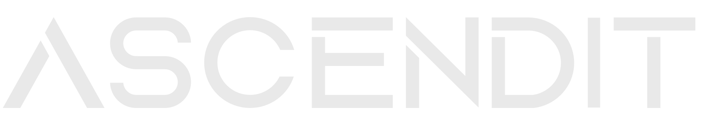
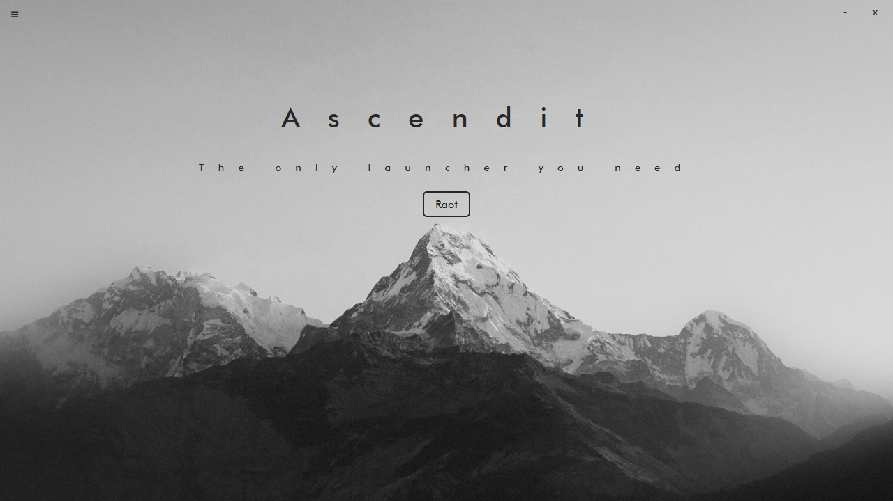

  
  
  <h3 align="center">Ascendit Launcher</h3>
  
  
A lauchner made in Electron for all current Ascendit-based Clients

   
  
  

# Features
- Automatically executes and injects cheat into a supported game
- Modify default path and auto-execute in `config.json`
- Auto Update
- Small binary size (fuck electron)

# Building
- Make sure `npm` is installed -> run `npm run tauri build`
- Use the nightly build for rust

